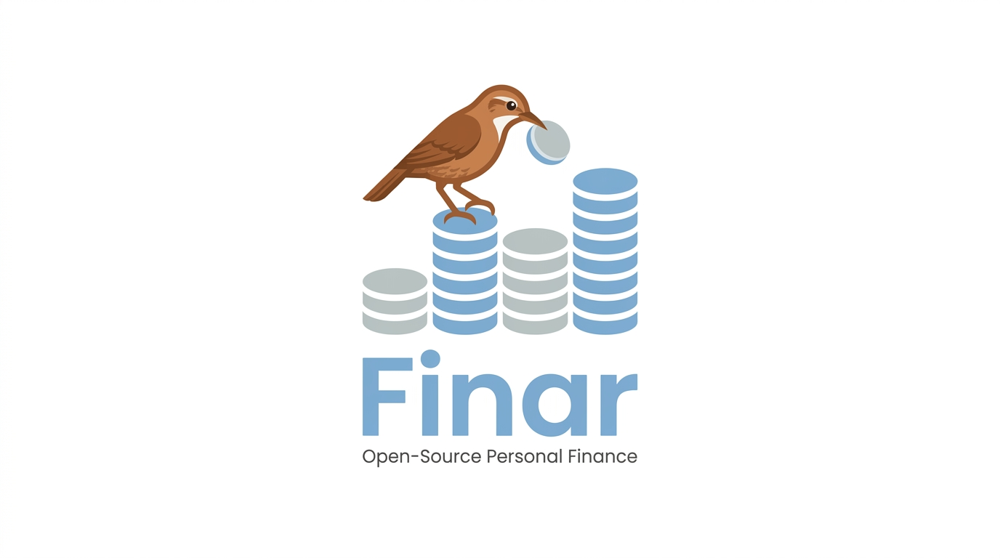

> Proyecto destinado a democratizar las finanzas personales de los Argentinos. Totalmente local, libre y gratuito.

> [!IMPORTANT]
> This project is in **early alpha**. You may encounter bugs, unexpected behaviors, and drastic/breaking changes between releases.

Built with Bun, React, Drizzle ORM, SQLite, and Zod.

## Quick Start

```bash
bun install
bun run dev
```

Server runs on `http://localhost:3000`.

## Scripts

- `bun run dev` - start server with hot reload
- `bun run build` - compile production binary (`fintracker`)
- `bun run build:linux|build:macos|build:windows` - platform binaries
- `bun run build:all` - build all platform targets
- `bun run db:generate` - generate Drizzle migration SQL from schema changes
- `bun run db:embed` - regenerate embedded migration index for compiled binaries
- `bun run db:migrate` - apply pending migrations with Drizzle Kit
- `bun test` - run all tests

## Repository Structure

The codebase follows a layered domain structure:

- `docs/`: product and implementation planning docs.
- `src/api/`: HTTP transport adapters, route composition, and request/response helpers.
- `src/modules/`: domain modules with `service` + `repository` + domain type definitions.
- `src/db/`: Drizzle schema, migrations, DB bootstrap, and runtime validation schemas.
- `src/frontend/`: React UI app, pages/features, shared UI components, and API client wrapper.
- `tests/`: integration-style suites validating financial invariants and migration behavior.
- Root config files: Bun scripts, TypeScript config, and Drizzle config.

## Current Architecture Patterns

- API routes are transport adapters only: parse request, validate, call service, map errors.
- Business logic lives in `src/modules/*/*-service.ts`.
- DB access lives in `src/modules/*/*-repository.ts`.
- Shared HTTP helpers are in `src/api/http/request.ts` and `src/api/http/response.ts`.
- Runtime validation uses Zod schemas in `src/db/validation.ts`.
- JSON API payloads use snake_case fields.
- Currency aggregation is centralized in `src/modules/currency/*`.
- Money mutations in payment flows use SQLite transactions in `PaymentService`.

## Database Migrations

The canonical schema source is:

- Drizzle schema: `src/db/schema.ts`
- Migration SQL: `src/db/migrations/*.sql`

Migrations are applied automatically during startup via `runMigrations()` in `src/db/database.ts`.

After schema changes:

```bash
bun run db:generate
```

Then commit both the schema change and new migration file.

## Tests

```bash
bun test
```

Test suite patterns:

- Financial invariants: payment atomicity, overdraft and installment correctness.
- Currency consistency: mixed-currency conversion and aggregate correctness.
- Migration safety: baseline compatibility, schema constraints, and idempotent migration execution.
